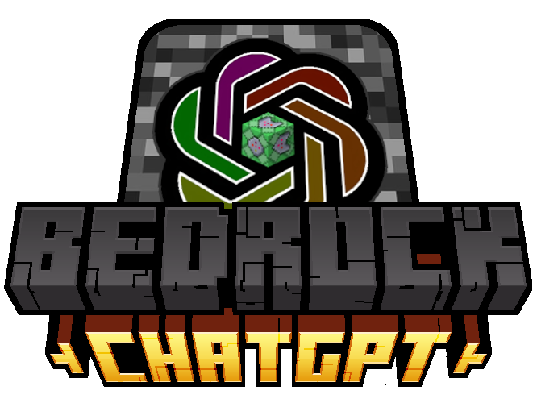
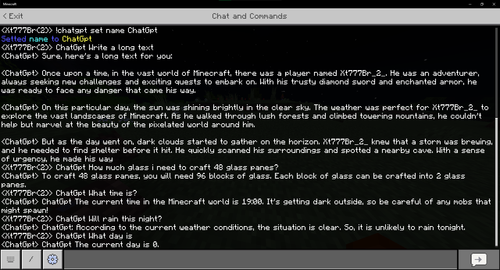

# Bedrock ChatGpt

ChatGpt for Minecraft Bedrock using Web Sockets.


## Demonstrations



## Commands

### Help
```
  !chatgpt help 
```

| Parameters | Description                          |
| :--------- | :---------------------------------- |
|  `1` | Show the help page about **!chatgpt help**. |
|  `2` | Show the help page about **!chatgpt set**. |
|  `3` | Show the help page about **!chatgpt info**. |
|  `4` | Show the help page about **!chatgpt get**. |
|  `5` | Show the help page about **!chatgpt credits**. |

### Set
```
  !chatgpt set 
```

| Parameters | Description                          | Sub-Parameters |
| :--------- | :---------------------------------- | :------------ |
|  `model` | Set the ChatGpt Model. | gpt-4 / gpt-3.5-turbo / Variants
|  `temperature` | Set ChatGpt Temperature. | 0.0 - 2.0
|  `name` | Set the ChatGpt Name. | (16 Characters Name)
|  `aswner_all` | Set the Aswner All. | True / False
|  `require_tag` | Set the Require Tag. | True / False

### Info
```
  !chatgpt info
```

| Parâmetro   | Description       |
| :---------- | :--------- |
| None      | Show some Information about Bedrock ChatGpt |

### Get
```
  !chatgpt get 
```

| Parameters | Description                          |
| :--------- | :---------------------------------- |
|  `model` | Show the ChatGpt Model. |
|  `temperature` | Show the ChatGpt Temperature. |
|  `name` | Show the ChatGpt Name. |
|  `aswner_all` | Show the Aswner All. |
|  `require_tag` | Show the Require Tag. |

### Credits
```
  !chatgpt credits
```

| Parâmetro   | Description       |
| :---------- | :--------- |
| None      | Show the credits for Bedrock ChatGpt development! |


## Setting Up
For use ChatGpt require a OpenAi Key!

OpenAi have a free version with limited usage! And a paid version with less limitation!
You can get you key on https://openai.com/
## Running

### Running on Windows:
In Windows is very easy to run! Its just run like a normal program, but will require firewall permission and you need allow to public and private!

### Running on Linux / Termux ( Proot Works Better! )

To run in Linux you need to execute inside of directory of program and type in terminal: 
```bash
./bedrock_chatgpt
```

##Connecting

If you try connect on Minecraft Windows and dont work, type the following command in PowerShell as Admin:
```powershell
CheckNetIsolation LoopbackExempt -a -n="Microsoft.MinecraftUWP_8wekyb3d8bbwe" (Powershell with Admin rights)
```

## Know Issues

****Crash on Start after of close Server!****

****Maybe a Lazy Start on first Start!****

    
