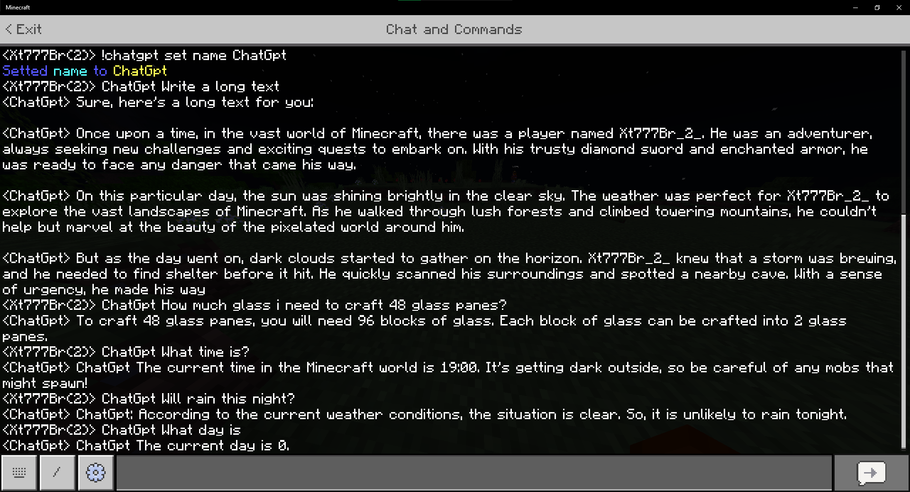

# BedrockChatGpt
ChatGpt for Minecraft using Web Scocket Server.

### The Project is almost done! I am working in better user experience and more intuitive program.

# Demonstration Screenshot

## Resources and Others

I dont have a paid version of ChatGpt so in release you may have problems using paid version. So report with a screenshot!

This program can take some information about world! For now he just can take 3 information: Day, Day, Weather. I have plans to improve in future version using addons to better informations and speed!

This program is fully Python but it will not be open source, because i want make better version more optimized and organized. Maybe you can get the codes aceesing with other ways but its is ok. Just dont steal the codes!

How everyone know Chatgpt dont have a updated informations so he can not know newest minecraft things!

ChatGpt is really dumb in minecraft but it is being better with the time. How you can see in the question about glass panes.

# Possible Asks

**It wiil be released to Android?**

I have plans to port to all Operating Systems including android this probally will be released to Termux

**It is a mod?**

No, this is just a server connected to your world. The server read player message and make the magic and execute the message into your world!

**It wiil release soon?**

Yes, in about 2-3 days

**Why this asks?**

Idk i just want give a explanation if some body fall here!

#  Thanks for lost your time reading about my project! I will try release soon!
